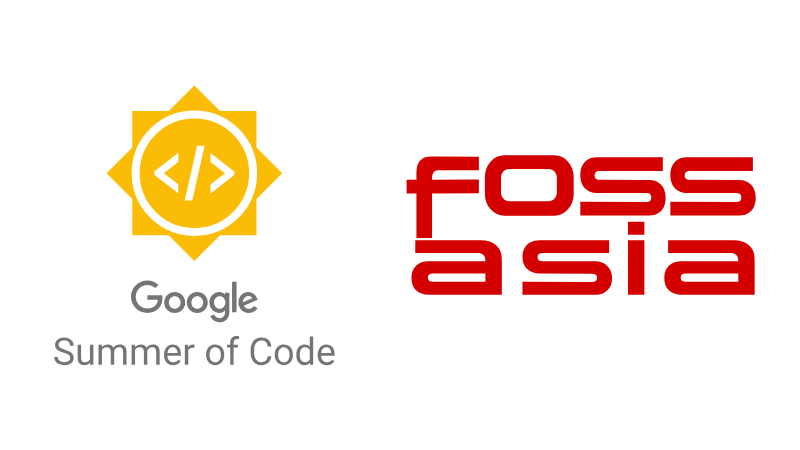

# Google Summer of Code 2025

---
## Project Overview

As PSLab transitions from a native Android app to a Flutter-based cross-platform application, this project focuses on developing and enhancing **core sensor modules**, building a **reusable experimentation framework**, and introducing advanced features for **csv data handling and visualization**. The aim is to deliver a cohesive, extensible system that not only replicates existing functionality but significantly improves usability, scientific learning, and mobile data workflows. Alongside sensor integration, the project will introduce a reusable experimentation framework. To support effective data workflows, the project will include functionality for logging, exporting, and importing sensor data using CSV files.

--- 

## Project Details
- **Student name:** [Yugesh Kumar S](https://github.com/Yugesh-Kumar-S)
- **Project Title:** [PSLab : Sensor Module Integration, Experiment Framework, and Data Intelligence Tools](https://summerofcode.withgoogle.com/programs/2025/projects/AD7fchJF)
- **Organization:** [FOSSASIA](https://fossasia.org/)
- **Mentors:** [Marc Nause](https://github.com/marcnause), [Padmal](https://github.com/CloudyPadmal), [Alexander Bessman](https://github.com/bessman)
- **GitHub Repository:** [pslab-app](https://github.com/fossasia/pslab-app)

---

## Work Summary

The detailed contributions and work completed are documented in the following sections

- [Phase 1 Report](phase1)  
- [Phase 2 Report](phase2)  

Please refer to these sections for a complete breakdown of the work completed during GSoC 2025.
