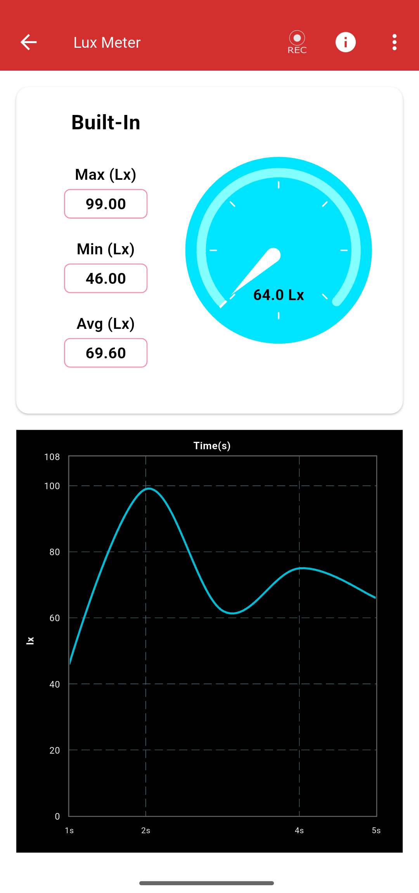
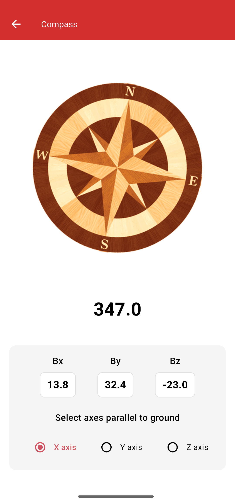
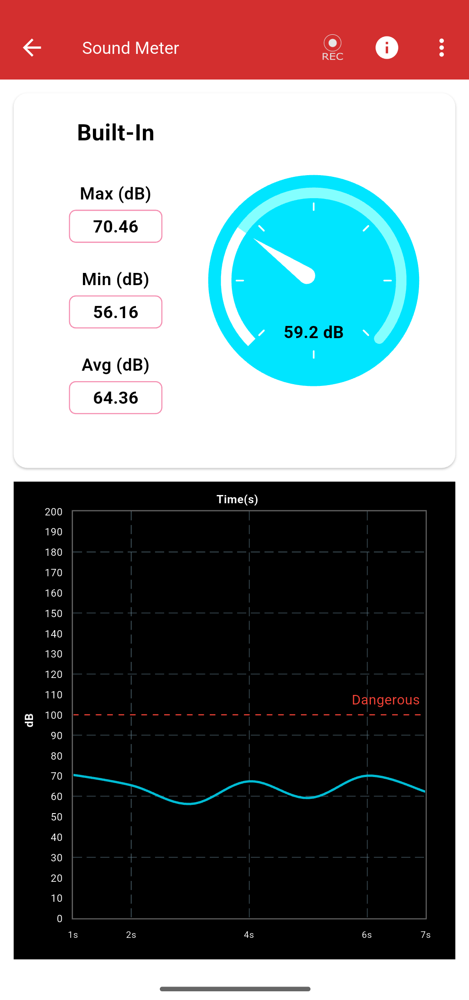
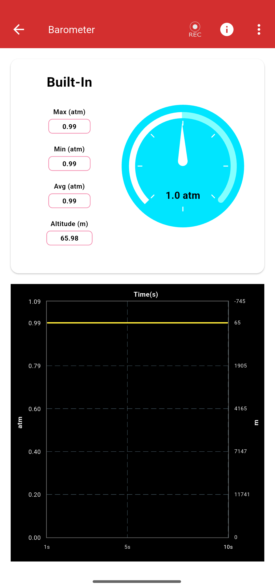
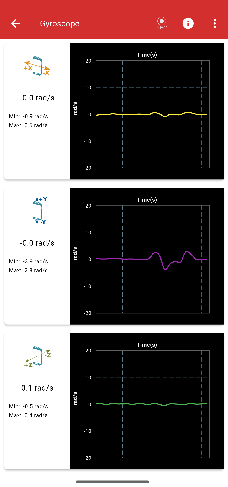
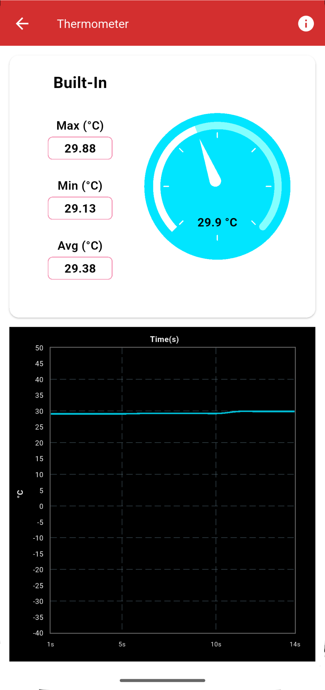
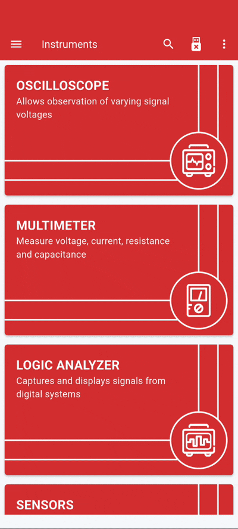
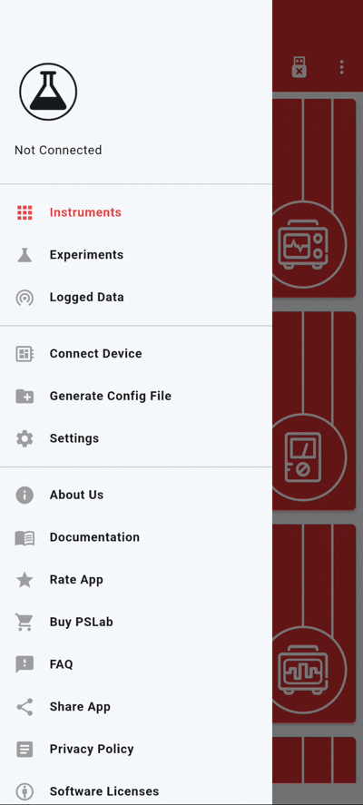
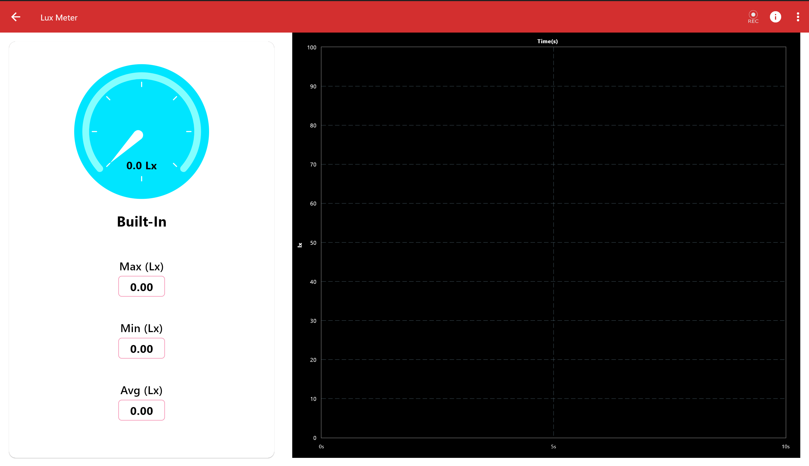

# Phase 1

Once the coding period began, I started working on **instruments that use built‑in mobile sensors**.  
To ensure reusability and consistency across the app, I created **modular widgets** that serve as the foundation for instrument screens.

## Instruments Implemented
The following instruments were ported into the PSLab Flutter app:

- [**Compass**](https://github.com/fossasia/pslab-app/pull/2710)  
- [**Gyroscope**](https://github.com/fossasia/pslab-app/pull/2723)  
- [**Sound Meter**](https://github.com/fossasia/pslab-app/pull/2739)  
- [**Lux Meter**](https://github.com/fossasia/pslab-app/pull/2733)  
- [**Barometer**](https://github.com/fossasia/pslab-app/pull/2743)  
- [**Thermometer**](https://github.com/fossasia/pslab-app/pull/2761)  

|  |  |  |
|---|---|---|
|  |  |  |

---

## Additional Features

### Instrument Search  
With PSLab offering a wide range of instruments, navigation could become overwhelming.  
To improve accessibility, I implemented a **search bar** that allows users to quickly find instruments.  

---

### Theming Support  
I introduced **light/dark theme support** and refactored the codebase to adapt dynamically to the system theme.  
This ensures a more modern and user-friendly experience across devices.  

---

### Responsive UI  
All the implemented instrument screens were adapted for **different screen sizes** to ensure usability across phones and desktops.  

